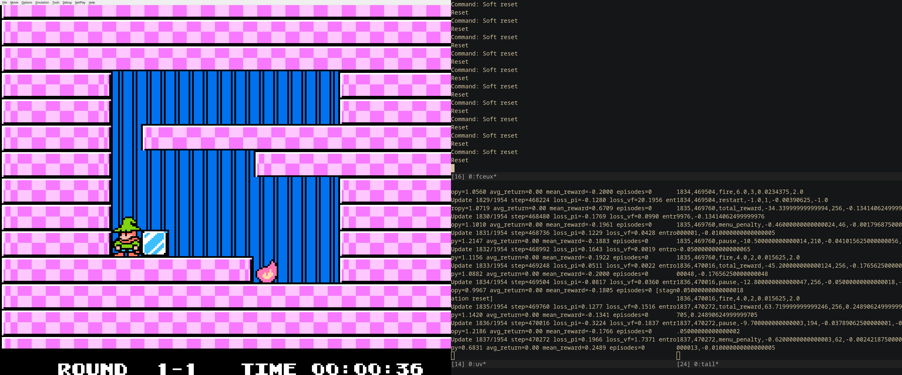
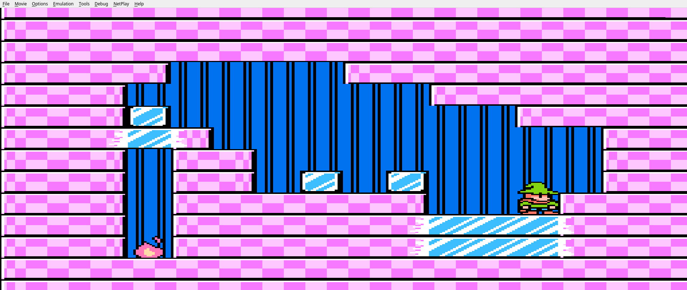

## Fire 'n Ice PPO Trainer

Train a Proximal Policy Optimisation (PPO) agent to master *Fire 'n Ice* using an FCEUX emulator bridge, stacked CNN observations, and memory-based reward shaping. The Lua bridge restores a savestate and force-loads the requested world/level on every reset so the agent never has to traverse title or level-select menus.



At the moment the model fails to reliably pass level 1-5 due to the extremely sparse reward here and long, specific series of inputs required to succeed:



A more sophisticated reinforcement learning algorithm / world model may be required here.


### Prerequisites
- [uv](https://docs.astral.sh/uv/) for Python dependency management
- FCEUX ≥ 2.6.6 rebuilt against **system Lua 5.1** (Qt front end) - e.g. build from source on Arch Linux
- LuaRocks-installed modules for Lua 5.1: `lua-zmq`, `luasocket`, `dkjson`
- Fire 'n Ice (USA) ROM — SHA256 `197833f0ac0e87a824f008bdaf5e429b9688a5dbfee0b65cb6b731e1a3ee77e5`

### Repository Layout
- `fireicerl/`
  - `bridge.py` – ZeroMQ REQ client for Lua bridge
  - `environment.py` – Gymnasium wrapper with frame stacking & speed control
  - `reward.py` – shaped rewards (fires, completion, restarts, death; menu signals logged for diagnostics)
  - `ppo.py` / `logging.py` – training loop, metrics, stagnation resets
- `lua/fireice_bridge.lua` – FCEUX-side bridge (frame capture, events, direct level injection)
- `main.py` – CLI entry point for training/resume
- `PLAN.md`, `notes.txt` – memory map notes and roadmap
- `roms/1-1-nounlock.sav` – default savestate used when jumping straight into a level

### Setup & Emulator Launch
```bash
uv sync  # install Python deps

fceux "/path/to/Fire 'n Ice (USA).nes" \
  --loadlua lua/fireice_bridge.lua
```
Wait for “bound to tcp://*:5555” in the Lua console, then optionally disable audio/video sync for max speed.
Make sure the savestate pointed to by `--save-state-path` (default `roms/1-1-nounlock.sav`) exists; the bridge restores it and rewrites the world/level bytes so training always resumes directly inside a stage.

### Training the Agent
```bash
 uv run python main.py train \
   --total-timesteps 8000000 \
   --rollout-steps 256 \
   --log-dir logs/run14 \
   --checkpoint-dir checkpoints/run14 --speed-mode nothrottle \
   --cnn-snapshot-dir cnn/run14 --cnn-snapshot-interval 256 \
   --init-weights checkpoints/run13/checkpoint_update_03907.pt
```
Useful flags:
- `--speed-mode {normal|turbo|nothrottle}` – mirrors `emu.speedmode`
- `--checkpoint-interval`, `--checkpoint-dir`, `--log-dir`, `--init-weights`
- `--initial-world`, `--initial-level`, `--save-state-path` – configure which stage the loader injects after every reset (no menu navigation required)

`metrics.csv` records losses, returns, and `stagnation_reset` events; `reward_components.csv` breaks down components (`fire`, `completion`, `restart`, `death`, `pause`, `menu_entry` — this should stay near zero), etc.

### Reward & Event Signals
- Fires remaining `$00AB` (positive on decrease, bonus at zero)
- Level completion `$06A9 == 0` (single reward per *new* completion per run)
- World progress bitmasks `$0400–$0413`
- Level-select diagnostics `$0324/$0328` (these should stay zero during training; any spike means the loader slipped back to a menu)
- Pause flags `$031D/$0321` and death animation `$0003 == 8` (penalties)
- In-level flags `$0018/$001C/$00D0` sanity-check that the loader really spawned us into gameplay
- World/level index: `$00B4` is world index*10 + level index (note index starts from 0), `$00B5` is level index (extracted from `$00B4`),  `$00B6` is world index (extracted from `$00B4`), 
- Colour palette: `$00D4` (corresponds to world index)
- Game loop function setting: `$0002` - a value of `6` means to reset /
  load a level.

Tune magnitudes in `fireicerl/reward.py` as needed; metrics automatically export any new components.

### Tips & Troubleshooting
- `--nogui` disables Lua so cannot be used for headless runs here.
- Ensure TCP port `5555` is free before launching; restart FCEUX if the bridge fails to bind.
- If you ever land on the title or level-select screen during training, double-check the savestate path and loader configuration—menus should never appear under normal operation.
- For speed, combine `--speed-mode nothrottle`, disabled sync in FCEUX, and higher `--frame-skip`.
- If reward totals stay positive after finishing a level, confirm `reward_components.csv` shows only one `completion` entry—otherwise the level may not have exited properly.

### TODOs

- Improve rewards for better convergence (we have sparse rewards at the
  moment) - e.g. see level 1-5.
- Is there a way of building fceux so it will run without graphics but
  still run Lua? Can we still read the VRAM in this case?
- Is there a faster emulator where we can directly send input and read
  VRAM without the Lua bridge?
- How can we make this easy to run in parallel?
